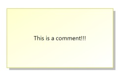
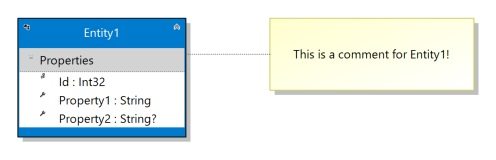

# Comments

Comment blocks don't generate code; they're just used to add explanatory text to the designer
for those times when you really need to explain something. You can change the size of the
comment both horizontally and vertically.

Just drag a comment onto the design surface, click into it and start typing. There's no limit
to the amount of text that can be entered.

## Comment Links

A comment link attaches a comment to either an entity or an enum. As you move things around,
that attachment moves with it, so you can indicate that a comment refers to some element on
the designer and you won't lose track of what that element is.

To add a comment link, choose the comment connector tool from the toolbox and, starting at the
comment you want to link, click and hold the left mouse button, dragging to the Entity or Enum you
want to link it to. Note that only Entities and Enumerations are linkable to comments,
and starting the connector from anything but the comment itself won't work.

### Next Step 
[Importing Code](Importing)

