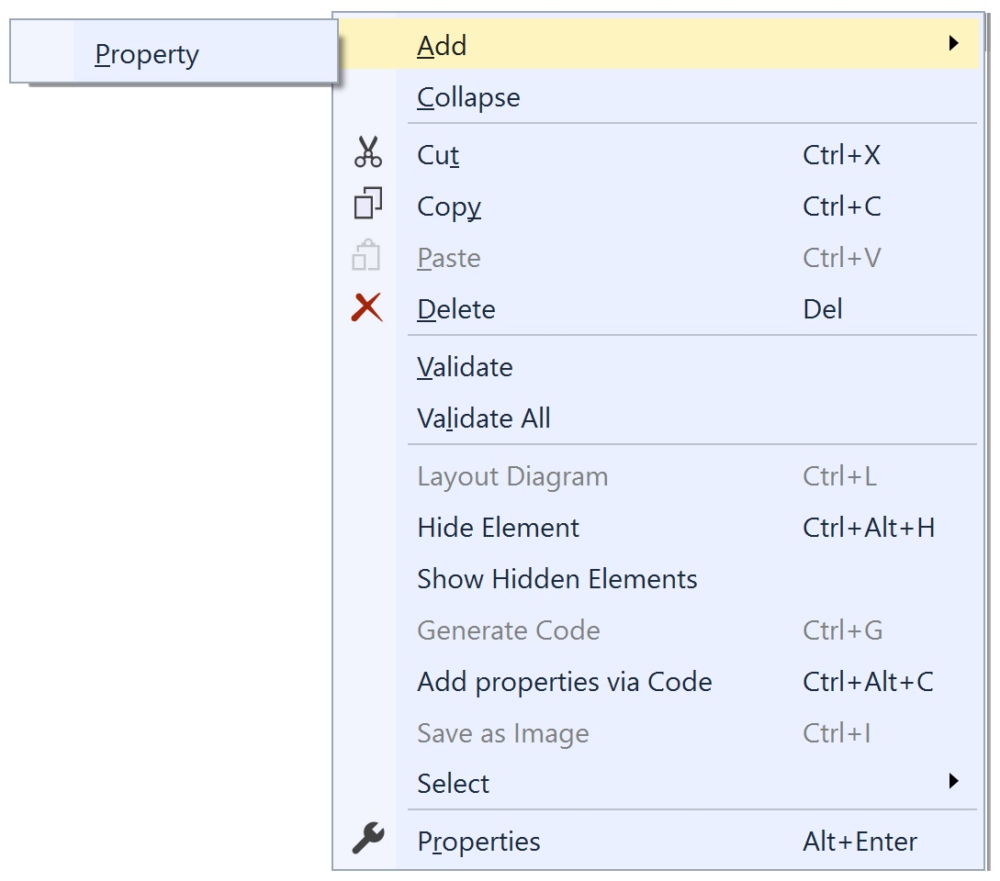

# Persistent Entities

Modeling your persistent entities (classes) is the same experience as most any other modeling tool -- you drag the class onto the design surface from the toolbox, name it, and start adding properties. You won't model operations (methods), though, since our focus is on creating code for Entity Framework. If you want to add operations, you'll do that in partial classes.

## Adding an Entity

With the designer open, find the Entity tool in your toolbox. Click and hold down the left button, then drag it to the design surface.


You should see a new class appear on the design surface:

<table><tr><td>

</td></tr></table>

You can change the width of the entity on the designer to make things more readable. Height is automatic and can't
be changed manually - it will be as tall as needed to show all the properties.
But the entity may be collapsed down to its name bar by clicking the chevron at the top right of its display. When
collapsed, it may be expanded back to its original size by clicking the chevron again.

You can collapse and expand the `Properties` and `Associations` compartments by clicking the small `+` (or `-`) icon to the
left of their gray title bars.

## Removing an Entity

To remove an entity, simply select it and hit the Delete key. It will be removed from the model completely without confirmation.

If that entity is the superclass (base class) for other entities, you'll be asked if you want to push its
attributes and associations down to those other entities prior to its removal.

## Entity Properties

Selecting the entity allows you to edit its various properties:

<table>
<thead>
<tr><th valign="top"><b>Property</b></th><th valign="top"><b>Description</b></th></tr>
</thead>
<tbody>
<tr><td valign="top" colspan="2" style="background-color: gainsboro"><b>Code Generation</b></td></tr>
<tr><td valign="top"> Abstract                           </td><td valign="top"> <i>Boolean</i>. If true, an abstract class will be generated for this entity.</td></tr>
<tr><td valign="top"> Concurrency                        </td><td valign="top"> <i>String</i>. Overrides the default concurrency handling strategy. Values are 'Optimistic' and 'None'. See <a href="https://docs.microsoft.com/en-us/aspnet/mvc/overview/getting-started/getting-started-with-ef-using-mvc/handling-concurrency-with-the-entity-framework-in-an-asp-net-mvc-application">Handling Concurrency with the Entity Framework 6 in an ASP.NET MVC 5 Application</a>.</td></tr>
<tr><td valign="top"> Custom Attributes                  </td><td valign="top"> <i>String</i>. Attributes generated in the code for this element - anything here will be generated verbatim into the code in the class definition.</td></tr>
<tr><td valign="top"> Custom Interfaces                  </td><td valign="top"> <i>String</i>. Any custom interface(s) this entity should implement. If more than one, separate them with commas - anything here will be generated verbatim into the code in the class definition.</td></tr>
<tr><td valign="top"> DbSet Name                         </td><td valign="top"> <i>String</i>. The name of the DbSet property in the DbContext for this class.</td></tr>
<tr><td valign="top"> Implement INotifyPropertyChanged   </td><td valign="top"> <i>Boolean</i>. If true, will generate code for easy implementation of property change notifications.</td></tr>
<tr><td valign="top"> Name                               </td><td valign="top"> <i>String</i>. The name of this class.</td></tr>
<tr><td valign="top"> Namespace                          </td><td valign="top"> <i>String</i>. The namespace for this class.</td></tr>
<tr><td valign="top"> Output Directory                   </td><td valign="top"> <i>String</i>. The project directory for this class's generated file. Overrides the default Entity Output Directory.</td></tr>
<tr><td valign="top" colspan="2" style="background-color: gainsboro"><b>Database</b></td></tr>
<tr><td valign="top"> Database Schema                    </td><td valign="top"> <i>String</i>. The database schema name for the table that will back this class.</td></tr>
<tr><td valign="top"> Is Dependent Type                  </td><td valign="top"> <i>Boolean</i>. If true, this type will be generated as a <a href="https://msdn.microsoft.com/en-us/library/jj680147(v=vs.113).aspx#What%20is%20a%20Complex%20Type">"complex" (EF6)</a> or <a href="https://docs.microsoft.com/en-us/ef/core/modeling/owned-entities">"owned" (EFCore)</a> type.</td></tr>
<tr><td valign="top"> Table Name                         </td><td valign="top"> <i>String</i>. The name of the table that will back this class.</td></tr>
<tr><td valign="top" colspan="2" style="background-color: gainsboro"><b>Display</b></td></tr>
<tr><td valign="top"> Fill Color                         </td><td valign="top"> <i>Color</i>. The color for entity's banner on the design surface.</td></tr>
<tr><td valign="top"> Visible                            </td><td valign="top"> <i>Boolean</i>. If true, the entity will be visible on the design surface. If false, will be hidden. Can also be toggled via the context menu when the entity is selected.</td></tr>
<tr><td valign="top" colspan="2" style="background-color: gainsboro"><b>Documentation</b></td></tr>
<tr><td valign="top"> Comment Detail                     </td><td valign="top"> <i>String</i>. XML comment &lt;Remarks&gt; section</td></tr>
<tr><td valign="top"> Comment Summary                    </td><td valign="top"> <i>String</i>. XML comment &lt;Summary&gt; section</td></tr>
</tbody>
</table>

## Context Menu

Right-clicking on an entity displays a Visual Studio context menu with some new choices pertinent to that entity.

<table style='margin-bottom: 10px;'><tr><td>

</td></tr></table>

<table>
<thead>
<tr><th valign="top"><b>Menu choice</b></th><th valign="top"><b>Description</b></th></tr>
</thead>
<tr><td valign="top"> Add                                      </td><td>One submenu choice, <i>Property</i>, adds a property to the entity.</td></tr>
<tr><td valign="top"> Collapse                                 </td><td>Available when the entity is fully expanded, this action hides the properties so that only the title is visible.</td></tr>
<tr><td valign="top"> Expand                                   </td><td>Available when the entity is fully collapsed, this action shows the properties, revsersing the _Collapse_ action.</td></tr>
<tr><td valign="top"> Cut, Copy, Paste, Delete                 </td><td valign="top">You can cut or copy, then paste, classes and enums. The pasted elements will be adjusted so that they don't violate any rules (such as two elements not having the same name), but otherwise the properties will stay the same. If no classes or enums are selected in the designer, the cut and copy options will be disabled. If no classes or enums are in the clipboard, the paste option will be disabled.</td></tr>
<tr><td valign="top"> Validate                                 </td><td valign="top">Checks the currently selected entity against the validation rules built into the designer. Errors or warnings are displayed in Visual Studio's Error List window. If no element is selected, this validates the design surface itself.</td></tr>
<tr><td valign="top"> Validate All                             </td><td valign="top">Checks all model elements against the afore mentioned validation rules. Errors or warnings are displayed in Visual Studio's Error List window.</td></tr>
<tr><td valign="top"> Hide Element                             </td><td valign="top">Hides the currently selected entity on the diagram. Any lines to or from that entity will be hidden as well. This does not remove the entity from the model, only makes it invisible in the diagram. Useful for tidying up a diagram that would otherwise be unreadable due to, for example, a common base class that all other classes inherit from. If no entity is selected, this option will be disabled.</td></tr>
<tr><td valign="top"> Show Hidden Elements                     </td><td valign="top">Unhides any elements that were previously hidden, along with their association or inheritance lines. If no elements are hidden, this option will be disabled.</td></tr>
<tr><td valign="top"> Add properties via Code                  </td><td valign="top">Displays a dialog that lets you add multiple properties using the designer's custom property syntax. See "<a href="Properties.html#adding-properties-via-code-custom-property-syntax">Adding properties via code</a>" for more details.</td></tr>
<tr><td valign="top"> Select                                   </td><td valign="top">One of the features of the Visual Studio property editor is the ability to edit properties of multiple items if they share that property. This submenu gives you the ability to select model elements by type so that you can conveniently edit properties of those elements together (e.g., setting the color of multiple classes all at once). If the pertinent element type isn't present in the designer, that option will be disabled.<br/>
   <table>
   <tr><td valign="top"> Select all classes...                    </td><td valign="top">Select all class elements in the designer</td></tr>
   <tr><td valign="top"> Select all enums...                      </td><td valign="top">Select all enum elements in the designer</td></tr>
   <tr><td valign="top"> Select all associations...               </td><td valign="top">Select all association lines (both unidirectional and bidirectional) in the designer</td></tr>
   <tr><td valign="top"> Select all unidirectional associations...</td><td valign="top">Select all unidirectiional association lines in the designer</td></tr>
   <tr><td valign="top"> Select all bidirectional associations... </td><td valign="top">Select all bidirectional association lines in the designer</td></tr>
   </table>
</td></tr>
<tr><td valign="top"> Properties                               </td><td valign="top">Switches focus to the Properties window.</td></tr>
</table>

### INotifyPropertyChanged

You can optionally implement the standard `INotifyPropertyChanged` interface, especially useful for data binding in WinForms applications. By changing that property to `True` (by
default it's `False`),. the standard T4 templates will generate code you can customize by implementing a partial method.

The shape on the diagram will change to have a dashed blue border, helping you immediately see which classes will generate 
change notification code. Since `INotifyPropertyChanged` requires a bit of logic, the properties of that class won't be 
autoproperties. Each property will be set to `AutoProperty = False` when `Implement INotifyPropertyChanged` is set 
to `True`; if you set `AutoProperty` to `True` while indicating that you want `INotifyPropertyChanged` code, you'll 
get a warning on model validation indicating that said property won't participate in change notification since it's an 
autoproperty. 


The generated code for a property will look like the following:

``` csharp
   /// <summary>
   /// Backing field for Foo
   /// </summary>
   protected string _Foo;
   /// <summary>
   /// When provided in a partial class, allows value of _Foo to be changed before setting.
   /// </summary>
   partial void SetFoo(string oldValue, ref string newValue);
   /// <summary>
   /// When provided in a partial class, allows value of _Foo to be changed before returning.
   /// </summary>
   partial void GetFoo(ref string result);

   public string Foo
   {
      get
      {
         string value = _Foo;
         GetFoo(ref value);
         return (_Foo = value);
      }
      set
      {
         string oldValue = _Foo;
         SetFoo(oldValue, ref value);
         if (oldValue != value)
         {
            _Foo = value;
            OnPropertyChanged();
         }
      }
   }

   public virtual event PropertyChangedEventHandler PropertyChanged;

   protected virtual void OnPropertyChanged([CallerMemberName] string propertyName = null)
   {
      PropertyChanged?.Invoke(this, new PropertyChangedEventArgs(propertyName));
   }
```

Note that this interface doesn't give you sufficient detail to know *how* a property changed, only *which* 
property changed; Microsoft never intended it to. Its initial purpose was to support data binding, so it's an
important part of .NET, but you need more info to handle property change notifications outside of a data binding
context. You have that in the code that's generated when you set `AutoProperty = False` in the model for an entity's
property.

Any generated property with a backing field gives you the chance to do work (log, massage the return value, etc.)
in their `get` and `set` methods by implementing the corresponding `GetXXX` and `SetXXX` partial functions. In those 
partials, you have access to the old and new values (for the `SetXXX` method) and can implement whatever logging, etc. 
you need. Therefore, when tracking changes, the generated `OnPropertyChanged` method will be used when the .NET Framework 
finds it appropriate but *your* work should go in the `SetXXX` partial method.

### Next Step 
[Properties](Properties)
