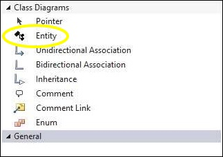
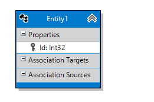

# Persistent Entities

Modeling your persistent entities (classes) is the same experience as any other modeling tool -- you drag the class onto the design surface from the toolbox, name it, and start adding properties. You won't model operations (methods), though, since our focus is on creating code for Entity Framework. If you want to add operations, you'll do that in partial classes.

## Adding an entity ##

With the designer open, find the Entity tool in your toolbox. Click and hold down the left button, then drag it to the design surface.

You should see a new class appear on the design surface:

<table><tr><td>

</td></tr></table>

Selecting the entity allows you to edit its various properties:

<table>
<tr><td valign="top"><b>Property</b></td><td valign="top"><b>Description</b></td></tr>
<tr><td valign="top" colspan="2"><b>Code Generation</b></td></tr>
<tr><td valign="top">Abstract</td><td valign="top"><i>Boolean</i>. If true, an abstract class will be generated for this entity.</td></tr>
<tr><td valign="top">Concurrency</td><td valign="top"><i>String</i>. Overrides the default concurrency handling strategy. Values are 'Optimistic' and 'None'. See <a href="https://docs.microsoft.com/en-us/aspnet/mvc/overview/getting-started/getting-started-with-ef-using-mvc/handling-concurrency-with-the-entity-framework-in-an-asp-net-mvc-application">Handling Concurrency with the Entity Framework 6 in an ASP.NET MVC 5 Application</a>.</td></tr>
<tr><td valign="top">Custom Interfaces</td><td valign="top"><i>String</i>. Any custom interface(s) this entity should implement. If more than one, separate them with commas - anything here will be generated verbatim into the code in the class definition.</td></tr>
<tr><td valign="top">DbSet Name</td><td valign="top"><i>String</i>. The name of the DbSet property in the DbContext for this class.</td></tr>
<tr><td valign="top">Name</td><td valign="top"><i>String</i>. The name of this class.</td></tr>
<tr><td valign="top">Namespace</td><td valign="top"><i>String</i>. The namespace for this class.</td></tr>
<tr><td valign="top" colspan="2"><b>Database</b></td></tr>
<tr><td valign="top">Database Schema</td><td valign="top"><i>String</i>. The database schema name for the table that will back this class.</td></tr>
<tr><td valign="top">Table Name</td><td valign="top"><i>String</i>. The name of the table that will back this class.</td></tr>
<tr><td valign="top" colspan="2"><b>Display</b></td></tr>
<tr><td valign="top">Fill Color</td><td valign="top"><i>Color</i>. The color for entity's banner on the design surface.</td></tr>
<tr><td valign="top">Visible</td><td valign="top"><i>Boolean</i>. If true, the entity will be visible on the design surface. If false, will be hidden. Can also be toggled via the context menu when the entity is selected.</td></tr>
<tr><td valign="top" colspan="2"><b>Documentation</b></td></tr>
<tr><td valign="top">Comment Detail</td><td valign="top"><i>String</i>. XML comment &lt;Remarks&gt; section</td></tr>
<tr><td valign="top">Comment Summary</td><td valign="top"><i>String</i>. XML comment &lt;Summary&gt; section</td></tr>
</table>

### Next Step 
[Associations](Associations)
