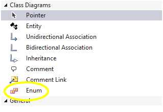
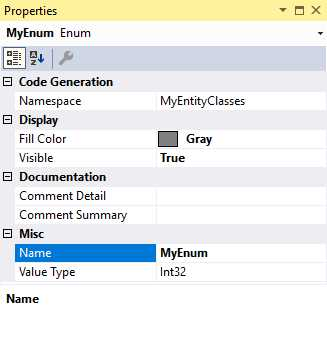
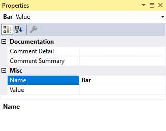
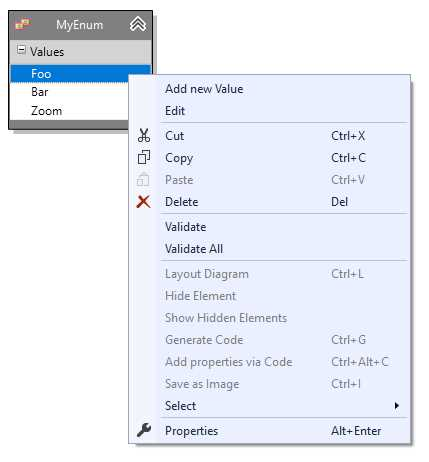

# Enumerations

Adding enumerations to the model allows you to use them as property types in entities. Although
they're modeled in the same way entities are, you won't be creating an association to an enumeration ...
rather, they'll be available when creating properties in the select list of *Type*.

To add an enumeration, drag it from the toolbox and drop it on the design surface, renaming as you see fit.

## Adding a value

Adding values is done in the same way as adding properties to an entity. 

- Right click the _Values_ category heading right below the name of the enum on the diagram and choose _Add new Value_ .
- Right click the name of the enum and select _Add_, then _Value_ from its context menu.
- With the _Values_ category heading selected, hit the _Insert_ key
- With any value selected in the enum, hit _Enter_.

Code for the enum's values will be generated in the order they appear in the designer. Since order matters unless
you add value initializers, the designer allows you to reorder the values by dragging a highlighted value up and down
the list. 

You can get more control over the generated value by providing an initializer. Not all values need to be 
initialized, although you will get a warning if you set some but not others. 

Both the enum and the values have property window entries. Properties of the enum itself are:

<table>
<thead>
<tr><th valign="top"><b>Property</b></th><th valign="top"><b>Description</b></th></tr>
</thead>
<tbody>
<tr><td valign="top" colspan="2" style="background-color: gainsboro"><b>Code Generation</b></td></tr>
<tr><td valign="top">Namespace</td><td valign="top"><i>String</i>. The namespace for this enum.</td></tr>
<!--<tr><td valign="top">Values are Flags</td><td valign="top"><i>Boolean</i>. If true, the [Flags] attribute will be output in the generated code and the values of the enum will be reset to binary increments in the order which they appear in the designer. If values already have initializers, you'll be asked to confirm the action before they're wiped out and reset.</td></tr>-->
<tr><td valign="top" colspan="2" style="background-color: gainsboro"><b>Display</b></td></tr>
<tr><td valign="top">Fill Color</td><td valign="top"><i>Color</i>. The color for enum's banner on the design surface.</td></tr>
<tr><td valign="top">Visible</td><td valign="top"><i>Boolean</i>. If true, the enum will be visible on the design surface. If false, will be hidden. Can also be toggled via the context menu when the enum is selected.</td></tr>
<tr><td valign="top" colspan="2" style="background-color: gainsboro"><b>Documentation</b></td></tr>
<tr><td valign="top">Comment Detail</td><td valign="top"><i>String</i>. XML comment &lt;Remarks&gt; section</td></tr>
<tr><td valign="top">Comment Summary</td><td valign="top"><i>String</i>. XML comment &lt;Summary&gt; section</td></tr>
<tr><td valign="top" colspan="2" style="background-color: gainsboro"><b>Misc</b> <i>NOTE: These will be moved to the "Code Generation" section in the next release.</i></td></tr>
<tr><td valign="top">Name</td><td valign="top"><i>String</i>. The name of this enum. </td></tr>
<tr><td valign="top">Value Type</td><td valign="top"><i>String</i>. The backing type for this enum in the code. Valid values are Int16, Int32 and Int64</td></tr>
</tbody>
</table>

Properies of the enum values are:

<table>
<thead>
<tr><th valign="top"><b>Property</b></th><th valign="top"><b>Description</b></th></tr>
</thead>
<tbody>
<tr><td valign="top" colspan="2" style="background-color: gainsboro"><b>Documentation</b></td></tr>
<tr><td valign="top">Comment Detail</td><td valign="top"><i>String</i>. XML comment &lt;Remarks&gt; section</td></tr>
<tr><td valign="top">Comment Summary</td><td valign="top"><i>String</i>. XML comment &lt;Summary&gt; section</td></tr>
<tr><td valign="top" colspan="2" style="background-color: gainsboro"><b>Misc</b> <i>NOTE: These will be moved to a "Code Generation" section in the next release.</i></td></tr>
<tr><td valign="top">Name</td><td valign="top"><i>String</i>. The name of this value. </td></tr>
<tr><td valign="top">Value</td><td valign="top"><i>Integer</i>. The (optional) decimal value of this enum value.</td></tr>
</tbody>
</table>

## Removing a value

To remove a value, simply select it and hit the Delete key. It will be removed from the model completely without confirmation.

<!--If enum values are being automatically generated due to the Flags attribute being set on the enum, these will be regenerated so that gaps don't exist.
-->
## Context Menu

Right-clicking on a value displays a Visual Studio context menu with some new choices pertinent to that value.

<table><tr><td>

</td></tr></table>
 
<table>
<thead>
<tr><th valign="top" style="width: 20%"><b>Menu choice</b></th><th valign="top"><b>Description</b></th></tr>
</thead>
<tbody>
<tr><td valign="top">Add new Value</td><td>Adds a value to the enum.</td></tr>
<tr><td valign="top">Edit</td><td>Activates in-diagram editing for the value name</td></tr>
<tr><td valign="top">Cut, Copy, Paste</td><td valign="top">You can cut or copy, then paste, properties. Pasting can be to the same entity or to other entities. The pasted elements will be adjusted so that they don't violate any rules (such as two elements not having the same name), but otherwise the properties will stay the same. If no properties are selected in the designer, the cut and copy options will be disabled. If no properties are in the clipboard, the paste option will be disabled.</td></tr>
<tr><td valign="top">Delete</td><td valign="top">The selected property will be removed from the entity.</td></tr>
<tr><td valign="top">Validate</td><td valign="top">Checks the currently selected entity against the validation rules built into the designer. Errors or warnings are displayed in Visual Studio's Error List window. If no element is selected, this validates the design surface itself.</td></tr>
<tr><td valign="top">Validate All</td><td valign="top">Checks all model elements against the afore mentioned validation rules. Errors or warnings are displayed in Visual Studio's Error List window.</td></tr>
<tr><td valign="top">Show Hidden Elements</td><td valign="top">Unhides any elements that were previously hidden, along with their association or inheritance lines. If no elements are hidden, this option will be disabled.</td></tr>
<tr><td valign="top">Select</td><td valign="top">One of the features of the Visual Studio property editor is the ability to edit properties of multiple items if they share that property. This submenu gives you the ability to select model elements by type so that you can conveniently edit properties of those elements together (e.g., setting the color of multiple classes all at once). If the pertinent element type isn't present in the designer, that option will be disabled. 
<table>
<tr><td valign="top">Select all classes...</td><td valign="top">Select all class elements in the designer</td></tr>
<tr><td valign="top">Select all enums...</td><td valign="top">Select all enum elements in the designer</td></tr>
<tr><td valign="top">Select all associations...</td><td valign="top">Select all association lines (both unidirectional and bidirectional) in the designer</td></tr>
<tr><td valign="top">Select all unidirectional associations...</td><td valign="top">Select all unidirectiional association lines in the designer</td></tr>
<tr><td valign="top">Select all bidirectional associations...</td><td valign="top">Select all bidirectiional association lines in the designer</td></tr>
<tr><td valign="top">Select all bidirectional associations...</td><td valign="top">Select all bidirectiional association lines in the designer</td></tr>
</table>
</td></tr>
<tr><td valign="top">Properties</td><td valign="top">Switches focus to the Properties window.</td></tr>
</tbody>
</table>

### Next Step 
[Adding Model Comments](Comments)
