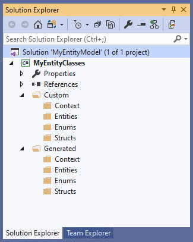

# Getting Started

The design surface is where you'll create the visual model of your persistent entities. The properties
you give them here will (or should, if you make changes to the T4 templates) drive the code generation. 
It represents (and is used to generate) the DbContext class in your project

More than one design surface can be added to your project, just as more than one DbContext can be 
present. 

## Create your project

Create a solution and a project. **Please note** that, as of this writing, ASP.NET Core and WebSite 
projects don't allow project items of type "Data" to be added via "Add New Item", so you won't be 
able to add an .efmodel file to those project types. Not a big deal, though ... best practices are 
to create a class library project to hold your entities so that the entities can be shared 
across multiple host programs (web app, console app, etc.). 

Note that the T4 templates included in the installation only generate *C#* code, although any 
language _could_ be generated. We [welcome any submissions](Development) of T4 templates for other languages.

Since we'll be generating code, now is a good time to create the folders where that code will 
eventually go. You're free to create any structure you desire. You can even decide to generate 
code directly into the main tree of your project, but that's rarely a good idea except for the 
simplest of projects . A good working structure would look like the following:

    Context
    |-- Custom
    |-- Generated
    |
    Entities
    |-- Custom
    |-- Generated
    |
    Enums
    |-- Custom
    |-- Generated

This gives you separation for your DbContext class (and its satellites), your persistent entities, 
and enumerations you use in those entities (generated by the model). Further separating "Custom" 
and "Generated" code gives you quick access to files you can modify ("Custom") and those you 
shouldn't ("Generated"). The "Custom" files will hold the partial classes you use to extend the 
generated code.

### Next Step 
[Using the Designer](Using-the-designer)
