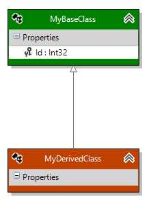

# Inheritance

Modeling inheritance is pretty straightforward. Select the Inheritance line and, starting at the derived class, click/hold/drag to the base class.

You won't be allowed to add multiple inheritance or to create circular inheritance patterns (e.g., A is derived from B, B is derived from A).

There aren't any properties on the inheritance line - selecting it in the designer will show an empty
property window. The only property related to inheritance is the context's <a href="Using-the-designer.html#design-surface-properties">Inheritance Strategy</a> on the design surface.

### Next Step 
[Enumerations](Enumerations)
