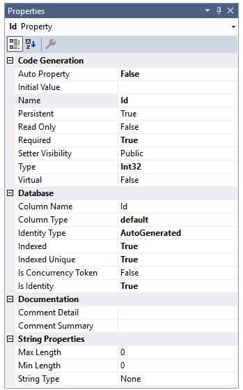
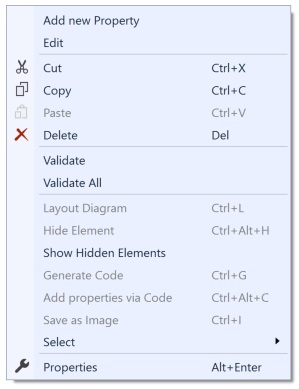

# Properties

Properties can be added to entities, and will become class properties backed with database columns
upon code generation. They're generated with reasonable defaults, but can be easily modified to
suit your use cases.

## Adding a Property

There are a few ways to add a property to an entity:

- Right click the _Properties_ category heading right below the name of the entity on the diagram and choose _Add new Property_ .
- Right click the name of the entity and select _Add_, then _Property_ from its context menu.
- With the _Properties_ category heading selected, hit the _Insert_ key
- With any property selected in the entity, hit _Enter_.

A new property will be added to the entity and you'll have the opportunity to change its name from the default generated name. An advanced feature
of the designer also gives you the opportunity to change its type, whether or not it's an identity field, and whether or not its value is required to be
other than the type's default value at runtime (i.e., a _required_ property). See more about this below.

Selecting a property gives you access to **its** properties in the Property window. Those are:

<table>
<thead>
<tr><td valign="top"><b>Property</b></td><td valign="top"><b>Description</b></td></tr>
</thead>
<tbody>
<tr><td valign="top" colspan="2" style="background-color: gainsboro"><b>Code Generation</b></td></tr>
<tr><td valign="top">Auto Property</td><td valign="top">If false, generates a backing store field with a partial method to hook getting and setting the property. If true, generates a simple auto property.</td></tr>
<tr><td valign="top">Initial Value</td><td valign="top">Value for attribute when first created</td></tr>
<tr><td valign="top">Name</td><td valign="top">The name of the property. Must be a valid C# symbol.</td></tr>
<tr><td valign="top">Persistent</td><td valign="top">Attribute will be stored in persistent storage</td></tr>
<tr><td valign="top">Read Only</td><td valign="top">If true, no setter will be generated. Only valid for transient public properties.</td></tr>
<tr><td valign="top">Required</td><td valign="top">If true, cannot be null (or the default value for the property type, if not nullable)</td></tr>
<tr><td valign="top">Setter Visibility</td><td valign="top">Visibility for property setter; getter is public</td></tr>
<tr><td valign="top">Type</td><td valign="top">Type of this attribute</td></tr>
<tr><td valign="top">Virtual</td><td valign="top">If true, property will be generated with the 'virtual' keyword</td></tr>
<tr><td valign="top" colspan="2" style="background-color: gainsboro"><b>Database</b></td></tr>
<tr><td valign="top">Identity Type</td><td valign="top">If this property is an identity, how the value is generated</td></tr>
<tr><td valign="top">Indexed</td><td valign="top">Should this attribute create an index in the database?</td></tr>
<tr><td valign="top">Indexed Unique</td><td valign="top">If indexed, is the index a unique index?</td></tr>
<tr><td valign="top">Is Concurrency Token</td><td valign="top">If true, this property serves as the concurrency value for the class</td></tr>
<tr><td valign="top">Is Identity</td><td valign="top">Does this attribute represent the identity of the object?</td></tr>
<tr><td valign="top">Table Override</td><td valign="top">Alternate table to store this attribute. If empty, the class's table is used.</td></tr>
<tr><td valign="top" colspan="2" style="background-color: gainsboro"><b>Documentation</b></td></tr>
<tr><td valign="top">Comment Detail</td><td valign="top"><i>String</i>. XML comment &lt;Remarks&gt; section</td></tr>
<tr><td valign="top">Comment Summary</td><td valign="top"><i>String</i>. XML comment &lt;Summary&gt; section</td></tr>
<tr><td valign="top" colspan="2" style="background-color: gainsboro"><b>String Properties</b></td></tr>
<tr><td valign="top">Max Length</td><td valign="top">Maximum length of the string, 0 for no max length</td></tr>
<tr><td valign="top">String Type</td><td valign="top">If not empty, will create a standard validation annotation for this attribute.</td></tr>
</tbody>
</table>

## Removing a Property

To remove a property, simply select it and hit the Delete key. It will be removed from the model completely without confirmation.

## Context Menu

Right-clicking on a property displays a Visual Studio context menu with some new choices pertinent to that property.

<table><tr><td>

</td></tr></table>
 
<table>
<thead>
<tr><td valign="top"><b>Menu choice</b></td><td valign="top"><b>Description</b></td></tr>
</thead>
<tbody>
<tr><td valign="top">Add new Property</td><td>Adds a property to the entity.</td></tr>
<tr><td valign="top">Edit</td><td>Activates in-diagram editing for the property name (and other attributes using the designer's custom property syntax)</td></tr>
<tr><td valign="top">Cut, Copy, Paste</td><td valign="top">You can cut or copy, then paste, properties. Pasting can be to the same entity or to other entities. The pasted elements will be adjusted so that they don't violate any rules (such as two elements not having the same name), but otherwise the properties will stay the same. If no properties are selected in the designer, the cut and copy options will be disabled. If no properties are in the clipboard, the paste option will be disabled.</td></tr>
<tr><td valign="top">Delete</td><td valign="top">The selected property will be removed from the entity.</td></tr>
<tr><td valign="top">Validate</td><td valign="top">Checks the currently selected entity against the validation rules built into the designer. Errors or warnings are displayed in Visual Studio's Error List window. If no element is selected, this validates the design surface itself.</td></tr>
<tr><td valign="top">Validate All</td><td valign="top">Checks all model elements against the afore mentioned validation rules. Errors or warnings are displayed in Visual Studio's Error List window.</td></tr>
<tr><td valign="top">Show Hidden Elements</td><td valign="top">Unhides any elements that were previously hidden, along with their association or inheritance lines. If no elements are hidden, this option will be disabled.</td></tr>
<tr><td valign="top">Select</td><td valign="top">One of the features of the Visual Studio property editor is the ability to edit properties of multiple items if they share that property. This submenu gives you the ability to select model elements by type so that you can conveniently edit properties of those elements together (e.g., setting the color of multiple classes all at once). If the pertinent element type isn't present in the designer, that option will be disabled. 
<table>
<tr><td valign="top">Select all classes...</td><td valign="top">Select all class elements in the designer</td></tr>
<tr><td valign="top">Select all enums...</td><td valign="top">Select all enum elements in the designer</td></tr>
<tr><td valign="top">Select all associations...</td><td valign="top">Select all association lines (both unidirectional and bidirectional) in the designer</td></tr>
<tr><td valign="top">Select all unidirectional associations...</td><td valign="top">Select all unidirectiional association lines in the designer</td></tr>
<tr><td valign="top">Select all bidirectional associations...</td><td valign="top">Select all bidirectiional association lines in the designer</td></tr>
<tr><td valign="top">Select all bidirectional associations...</td><td valign="top">Select all bidirectiional association lines in the designer</td></tr>
</table>
</td></tr>
<tr><td valign="top">Properties</td><td valign="top">Switches focus to the Properties window.</td></tr>
</tbody>
</table>

## Adding Properties via Code (custom property syntax)

You can quickly add a group of properties as text, a great time saver for those cases where you have existing classes that you want to make
persistent and add to the model.

The designer exposes a custom property syntax that allows you to specify a property's:

- Setter visibility
- Name
- Type
- Required status
- Maximum length (if it's a string)
- Initial value
- Whether it's the identity property for its entity

All of these are optional except for *Name*. The defaults for the others are:

<table>
<tr><td>Type</td><td>string</td></tr>
<tr><td>Required</td><td>false</td></tr>
<tr><td>Maximum Length</td><td>0</td></tr>
<tr><td>Initial Value</td><td>no initial value</td></tr>
<tr><td>Is Identity</td><td>false</td></tr>
</table>

The syntax is:

&lt;Visibility&gt; &lt;Type&gt;&lt;?&gt; &lt;Name&gt;&lt;!&gt;&lt;[Length]&gt; &lt;= Value&gt;

or

&lt;Visibility&gt; &lt;Name&gt;&lt;!&gt;&lt;[Length]&gt; : &lt;Type&gt;&lt;?&gt; &lt;= Value&gt;

[Unfinished]

### Next Step 
[Associations](Associations)
