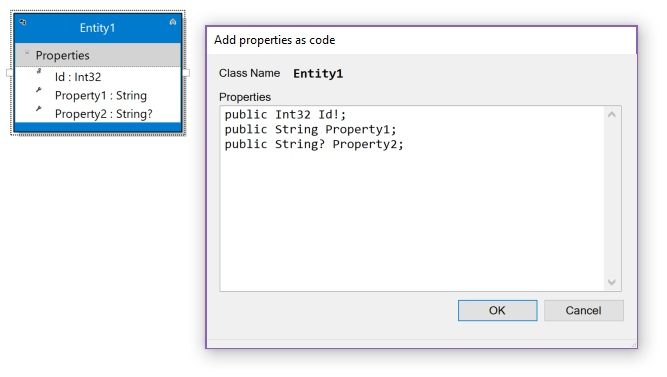
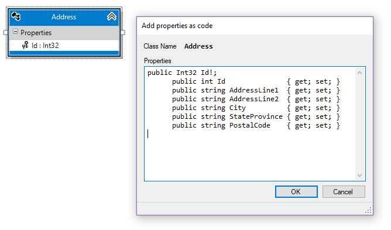
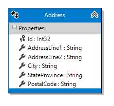

# Properties

Properties can be added to entities, and will become class properties backed with database columns
upon code generation. They're generated with reasonable defaults, but can be easily modified to
suit your use cases.

## Adding a Property


There are a few ways to add a property to an entity:

- Right click the _Properties_ category heading right below the name of the entity on the diagram and choose _Add new Property_ .
- Right click the name of the entity and select _Add_, then _Property_ from its context menu.
- With the _Properties_ category heading selected, hit the _Insert_ key
- With any property selected in the entity, hit _Enter_.

A new property will be added to the entity and you'll have the opportunity to change its name from the default generated name. An advanced feature
of the designer also gives you the opportunity to change its type, whether or not it's an identity field, and whether or not its value is required to be
other than the type's default value at runtime (i.e., a _required_ property). See more about this below.

## Removing a Property

To remove a property, simply select it and hit the Delete key. It will be removed from the model completely without confirmation.

## Property Properties

Selecting a property gives you access to **its** properties in the Property window. Those are:

<table>
<thead>
<tr><th valign="top"><b>Property</b></th><th valign="top"><b>Description</b></th></tr>
</thead>
<tbody>
<tr><td valign="top" colspan="2" style="background-color: gainsboro"><b>Code Generation</b></td></tr>
<tr><td valign="top">Auto Property</td><td valign="top"><i>Boolean.</i> If false, generates a backing store field with a partial method to hook getting and setting the property. If true, generates a simple auto property.</td></tr>
<tr><td valign="top">Initial Value</td><td valign="top"><i>String</i>. Value for attribute when first created. Will be validated to ensure entry is appropriate for the property's type</td></tr>
<tr><td valign="top">Name</td><td valign="top">The name of the property. Must be a valid C# symbol.</td></tr>
<tr><td valign="top">Persistent</td><td valign="top"><i>Boolean.</i> If true, Attribute will be stored in persistent storage</td></tr>
<tr><td valign="top">Read Only</td><td valign="top"><i>Boolean.</i> If true, no setter will be generated. Only valid for transient public properties.</td></tr>
<tr><td valign="top">Required</td><td valign="top"><i>Boolean.</i> If true, cannot be null (or the default value for the property type, if not nullable)</td></tr>
<tr><td valign="top">Setter Visibility</td><td valign="top"><i>String</i>. Visibility for property setter; getter is public. Valid entries are public and protected.</td></tr>
<tr><td valign="top">Type</td><td valign="top"><i>String</i>. Type of this attribute. Select from list of valid types.</td></tr>
<tr><td valign="top">Virtual</td><td valign="top"><i>Boolean.</i> If true, property will be generated with the 'virtual' keyword</td></tr>
<tr><td valign="top" colspan="2" style="background-color: gainsboro"><b>Database</b></td></tr>
<tr><td valign="top">Identity Type</td><td valign="top"><i>String</i>. If this property is an identity, how the value is generated? Choices are AutoGenerated (to let EF create it for you), Manual (doing it yourself) or None (this isn't an identity property)</td></tr>
<tr><td valign="top">Indexed</td><td valign="top"><i>Boolean.</i> If true, this property will create an index in the database</td></tr>
<tr><td valign="top">Indexed Unique</td><td valign="top"><i>Boolean.</i> If indexed and this is true, a unique index will be created in the database using this property</td></tr>
<tr><td valign="top">Is Concurrency Token</td><td valign="top"><i>Boolean.</i> If true, this property serves as the concurrency value for the class</td></tr>
<tr><td valign="top">Is Identity</td><td valign="top"><i>Boolean.</i> If true, this attribute represents the identity of the object. Will automatically set <i>Indexed</i> and <i>Indexed Unique</i> to <i>true</i></td></tr>
<tr><td valign="top">Table Override</td><td valign="top"><i>String</i>. Alternate table to store this attribute. If empty, the class's table is used.</td></tr>
<tr><td valign="top" colspan="2" style="background-color: gainsboro"><b>Documentation</b></td></tr>
<tr><td valign="top">Comment Detail</td><td valign="top"><i>String</i>. XML comment &lt;Remarks&gt; section</td></tr>
<tr><td valign="top">Comment Summary</td><td valign="top"><i>String</i>. XML comment &lt;Summary&gt; section</td></tr>
<tr><td valign="top" colspan="2" style="background-color: gainsboro"><b>String Properties</b></td></tr>
<tr><td valign="top">Max Length</td><td valign="top"><i>Integer</i>. Maximum length of the string, 0 for no max length</td></tr>
<tr><td valign="top">Min Length</td><td valign="top"><i>Integer</i>. Minimum length of the string, 0 for no min length. If non-zero, must be less than or equal to Max Length.</td></tr>
<tr><td valign="top">String Type</td><td valign="top"><i>String</i>. If not empty, will create a HTML5 attribute annotation for this attribute. Valid values are None, Color, Date, DateTime, Email, Month, Number, Range, Search, Telephone, Time, URI, Week, and Password.</td></tr>
</tbody>
</table>

## Context Menu

Right-clicking on a property displays a Visual Studio context menu with some new choices pertinent to that property.

<table><tr><td>

</td></tr></table>
<br/>
<table>
<thead>
<tr><th valign="top" style="width: 20%"><b>Menu choice</b></th><th valign="top"><b>Description</b></th></tr>
</thead>
<tbody>
<tr><td valign="top">Add new Property</td><td>Adds a property to the entity.</td></tr>
<tr><td valign="top">Edit</td><td>Activates in-diagram editing for the property name (and other attributes using the designer's custom property syntax)</td></tr>
<tr><td valign="top">Cut, Copy, Paste</td><td valign="top">You can cut or copy, then paste, properties. Pasting can be to the same entity or to other entities. The pasted elements will be adjusted so that they don't violate any rules (such as two elements not having the same name), but otherwise the properties will stay the same. If no properties are selected in the designer, the cut and copy options will be disabled. If no properties are in the clipboard, the paste option will be disabled.</td></tr>
<tr><td valign="top">Delete</td><td valign="top">The selected property will be removed from the entity.</td></tr>
<tr><td valign="top">Validate</td><td valign="top">Checks the currently selected entity against the validation rules built into the designer. Errors or warnings are displayed in Visual Studio's Error List window. If no element is selected, this validates the design surface itself.</td></tr>
<tr><td valign="top">Validate All</td><td valign="top">Checks all model elements against the afore mentioned validation rules. Errors or warnings are displayed in Visual Studio's Error List window.</td></tr>
<tr><td valign="top">Show Hidden Elements</td><td valign="top">Unhides any elements that were previously hidden, along with their association or inheritance lines. If no elements are hidden, this option will be disabled.</td></tr>
<tr><td valign="top">Select</td><td valign="top">One of the features of the Visual Studio property editor is the ability to edit properties of multiple items if they share that property. This submenu gives you the ability to select model elements by type so that you can conveniently edit properties of those elements together (e.g., setting the color of multiple classes all at once). If the pertinent element type isn't present in the designer, that option will be disabled.<br/>
<table>
<tr><td valign="top">Select all classes...</td><td valign="top">Select all class elements in the designer</td></tr>
<tr><td valign="top">Select all enums...</td><td valign="top">Select all enum elements in the designer</td></tr>
<tr><td valign="top">Select all associations...</td><td valign="top">Select all association lines (both unidirectional and bidirectional) in the designer</td></tr>
<tr><td valign="top">Select all unidirectional associations...</td><td valign="top">Select all unidirectiional association lines in the designer</td></tr>
<tr><td valign="top">Select all bidirectional associations...</td><td valign="top">Select all bidirectional association lines in the designer</td></tr>
</table>
</td></tr>
<tr><td valign="top">Properties</td><td valign="top">Switches focus to the Properties window.</td></tr>
</tbody>
</table>

## Adding Properties via Code (custom property syntax)

You can quickly add a group of properties as text, a great time saver for those cases where you have existing classes that you want to make
persistent and add to the model.

The designer exposes a custom property syntax that allows you to specify a property's:

- Setter visibility
- Name
- Type
- Required status
- Minimum length (if it's a string)
- Maximum length (if it's a string)
- Initial value
- Whether it's the identity property for its entity

All of these are optional except for *Name*. Some details:

<table>
<tr><td><b>Element</b></td><td><b>Default</b></td><td><b>Notes</b></td></tr>
<tr><td>Name</td><td></td><td>Required</td></tr>
<tr><td>Type</td><td>"string"</td><td>Can be CLR type or built-in type (e.g., Int32 or int)</td></tr>
<tr><td>Required</td><td>false</td><td>Indicated by the '?' symbol appended to the Type</td></tr>
<tr><td>Minimum Length</td><td>0</td><td>Indicated by a decimal number in brackets. If present, must be followed by hyphen <span style="display: inline-block;">('-')</span> and the maximum length. A zero (0) means no minimum length.</td></tr>
<tr><td>Maximum Length</td><td>0</td><td>Indicated by a decimal number in brackets. A zero (0) means no maximum length.</td></tr>
<tr><td>Initial Value</td><td></td><td>Indicated by an equal sign ('=') followed by some value</td></tr>
<tr><td>Is Identity</td><td>false</td><td>Indicated by the '!' symbol appended to the Name</td></tr>
</table>

The syntax is:

```
<Visibility> <Type><?><[MinLength-MaxLength]> <Name><!> <= Value>
```

or

```
<Visibility> <Name><!> : <Type><?><[MinLength-MaxLength]> <= Value>
```

**Examples:**

The following all declare a required string property with no length restrictions named foo:

```
foo
```

```
string foo
```

```
public string foo
```

```
foo: string
```

```
public foo: string
```

To make it an optional value:

```
string? foo
```

```
public string? foo
```

```
foo: string?
```

```
public foo: string?
```

Let's make it optional and restrict it to 50 characters:

```
string?[50] foo
```

```
public string?[50] foo
```

```
foo: string?[50]
```

```
public foo: string?[50]
```

Or ensure that it's between 10 and 50 characters


```
string?[10-50] foo
```

```
public string?[10-50] foo
```

```
foo: string?[10-50]
```

```
public foo: string?[10-50]
```

*(A bit more on this: MinLength isn't needed if you don't care about it, so [50] is perfectly
valid as a MaxLength specification. You would use [10-0] to say the MinLength is 10 but there
is no MaxLength, since having just one number in the brackets is interpreted as a MaxLength.
[0-50] is pefectly valid, but unnecessary, since [50] would do. [50-10] is right out - you'll get
an error trying to do that.*

*You might be wondering: if I specify a minimum length, does that mean it's required? 
The model won't automatically set the Required attribute if it sees a Min Length, since that
would mean that it's needed at object construction time, and you may not intend that to be true.)*


If we wanted to set it up in the entity's constructor with an initial value:

```
foo = "some value"
```

```
string foo = "some value"
```

```
public string foo = "some value"
```

```
foo: string = "some value"
```

```
public foo: string = "some value"
```

*(note that, while making a property optional and giving it a initial value is possible, it has limited
use cases)*

To add an identity property:

```
int foo!
```

```
public int foo!
```

```
foo!: int
```

```
public foo!: int
```

Let's make foo a `Nullable<Int64>` and have its setter inaccessible by outside code:

```
protected long? foo
```

```
protected foo: long?
```

To edit the properties as text, select the entity and right-click to get its context menu.
Choose _Add properties via Code_ and you'll see a small window pop up with the current
properties:

<table><tr><td>

</td></tr></table>

Add, edit or remove text as required - when you click *OK*, all the properties will be replaced
by the parsed values of the text in that window. Any unrecognized values will be discarded.

You'll note that one of the options is for the text to be a list of valid C# property declarations, so if you
have classes that you want to add to the model, you'll be able to copy their property declarations and
paste them in here. Any lines with curly braces in them will be truncated at the first open brace. Trailing semicolons
are discarded as well.

Let's say you had an Address class in your code and wanted to add it to your persistent entity model.

```C#

   public class Address
   {
      public int Id               { get; set; }
      public string AddressLine1  { get; set; }
      public string AddressLine2  { get; set; }
      public string City          { get; set; }
      public string StateProvince { get; set; }
      public string PostalCode    { get; set; }
   }

```

You could add the class to the designer and open the *Add properties via Code* window. Copy and paste the properties from your class into this window and click OK.

<table><tr><td>

</td></tr></table>

When you click OK, the Address class is updated with the new properties. 

<table><tr><td>

</td></tr></table>

A few things to notice:

- We duplicated the `Id` property, since it was already in the entity and we didn't delete it before pasting. When the text was parsed and the properties created, that duplicate was discarded. A warning appeared in Visual Studio's error list letting us know that it was discarded and why.
- The `{ get; set; }` blocks were discarded, as was the semicolon (`;`) from the one property initially presented.
- We added properties using CLR types (`int` and `string`), but they were added to the model as object types (`Int32` and `String`).
- The properties were added as required properties! C# syntax doesn't (unless you're using C# 8.0) have a way to indicate that an object is nullable or not. 
  Since we didn't edit the code we pasted in, no `?` indicators were present to tell the parser that this isn't a required property. Note that, even
  if we had C# 8.0 available, the designer's property syntax purposely doesn't fit with C# non-nullable object syntax. That's to make you review
  what you've entered and think about doing the right thing for your model!

### Next Step 
[Associations](Associations)
