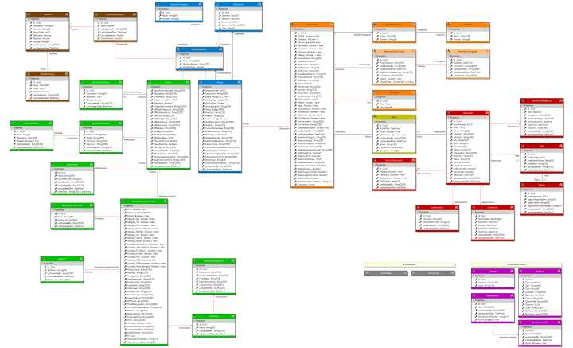

<!--# Entity Framework Visual Designer

### Entity Framework visual design surface and code-first code generation for EF6, EFCore and beyond.
-->
This Visual Studio 2017 IDE extension adds a new file type (.efmodel) that allows for visual 
design of persistent classes. Inheritance, unidirectional and bidirectional associations are all 
supported. Enumerations are also included in the visual model, as is the ability to add text 
blocks to explain potentially arcane parts of your design. 

T4 files are used to generate code-first DBContext and POCO class files for both EF6 and EFCore, 
and these can be modified to generate your own particular style.

<table width="100%"><tr><td align="center" width="100%">

</td></tr></table>

If you are used to the Entity Framework visual modeling that came with prior versions of 
Visual Studio, you'll be pretty much at home. The goal was to duplicate at least those features 
and, in addition, all the things that should have been there. Things like
- the ability to show and hide parts of the model
- easy customization of generated output
- class nodes that can be colored to visually group the model
- different concerns that can be generated into different subdirectories (entities, enums, dbcontext)
- entities by default being generated as partials so the default code can be easily modified
- string length, index flags, required attributes and other properties being available in the designer
- plus many other tiny bits that kept getting under my skin.

You should think of this extension as two parts: first the design surface and, separately, the 
T4 templates that generate the code. The template(s) can be changed without modifying, compiling 
and reinstalling the extension -- it's designed this way so that developers can easily make 
whatever changes suit their fancy to how the code is generated, since everybody's got their own 
personal quirks on how their code should look.

This documentation is a work-in-progress, so suggestions are welcome. The tool has been used in 
production (i.e., generating code for real projects) for quite a while, but more eyes and different 
approaches are always good.

### Next Step 
[Getting Started](Getting-Started)
